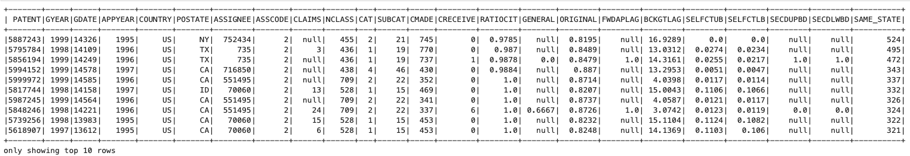
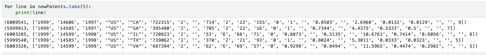

# CSCI 4253 / 5253 - Lab 4 - Patent Join in PySpark

In this lab, you're going to use PySpark's RDD and DataFrame interfaces to solve the patent join problem.

## The Patent join problem explained

The goal of the patent join problem is to find *self-state patent citations*. You're given two datasets, `cite75_99.txt.gz` and `apat63_99.txt.gz`.

You can download these gzip'd datasets at these links:
* https://storage.googleapis.com/csci4253/apat63_99.txt.gz
* https://storage.googleapis.com/csci4253/cite75_99.txt.gz

PySpark can automatically uncompress gzip'd files.

The `acite75_99.txt` file contains a citation index, of the form
```
CITING CITED
```
where both `CITING` and `CITED` are integers. Each line
indicates that patent number `CITING` cites patent `CITED`.

The `pat63_99.txt` file contains the patent number, an (optional)
state in which the patent is filed and the total number of citations
made.

Your job is to augment the data in `pat63_99.txt` to include a column
indicating the number of patents cited that originate *from the same
state*. Obviously, this data can only be calculated for patents that
have originating state information (and thus, only those from the US) and only for cited patents that provide that information. 

For example, 
patent 6009554 (the last patent in pat63_99.txt) cited 9 patents. Those patents were awarded to people in
* NY, 
* IL, 
* Great Britain (no state), 
* NY, 
* NY,
* FL,
* NY,
* NY,
* NY. 

For the first part, you would updates the line:

```
6009554,1999,14606,1997,"US","NY",219390,2,,714,2,22,9,0,1,,,,12.7778,0.1111,0.1111,,
```

To be: 
```
6009554,1999,14606,1997,"US","NY",219390,2,,714,2,22,9,0,1,,,,12.7778,0.1111,0.1111,,6
```

The last value `,6` is the number of same-state citations. You will
report the ten patents that have the most self-state citations sorted in descending order. These patents are shown in the table below:




To do this, you will first need do a "data join” of the citations and
the patent data - for each cited patent, you'll need to determine the
state of the cited patent. You can then use that information to
produce the augmented patent information.

It's useful to produce an intermediate result like

|Cited|Cited_State|Citing|Citing_State|
|-----|-----|------|-----|
|2134795	|None	|5654603	|OH
|2201699	|None	|5654603	|OH
|3031593	|None	|5654603	|OH
|3093764	|OH	|5654603	|OH
|3437858	|OH	|5654603	|OH
|3852137	|PA	|5654603	|OH
|3904724	|PA	|5654603	|OH

This table says that patent `3852137` is from `PA` and `5654603` is from `OH`.
You would construct this for each cited patent. From this, it's simple to determine
how many patents are self-sited for a given patent data line and then group and count those.

There are some complications:
* Not all patents in the 'cited' table are in the 'patent' table
* Not all patents cite other patents
* Not all patents are cited by other patents
* Lastly, the NaN/Null value used by PySpark makes sorting values involving Nan/Null and numeric values problematic; you're best filtering out the `null` values and then sorting.

## What you need to do and hand in

You're going to work on two solutions, one using the RDD API and the other using the DataFrame API.

The DataFrame API will execute much faster than the RDD API because it casts the computations into the underlying Java VM; it is recommended you finish that implementation using the [https://coding.csel.io](https://coding.csel.io) coding environment; select the "csci 4253" server.

For the DataFrame solution, you should implement your code using the starter code in the Jupyter notebook `Lab-04-patent-dataframe.ipynb`. That implementation should produce the reference output in the figure shown above.

For the RDD solution, you should implement your code using the starter code in the Jupyter notebook `Lab-04-patent-RDD.ipynb`. That implementation should also produce the same reference output as shown above, although it will look slighly different since it's in the RDD form.

You should document your solution process in the Jupyter notebook -- just add MarkDown cells and explain what you're doing at each step. You should commit your solution to GitHub -- you'll find that the current output will be viewable when looking at notebooks in GitHub.

### Some Suggestions

In both the RDD and DataFrame form, it's possible to "cache" an intermediate RDD/Dataframe (using the `.cache()` function). This can be useful when you're trying to figure out how to extract the appropriate data, etc. This is particularly important for the output of the `.join()` operations and particularly for the RDD solution -- that operation is *slow* and having to recompute it each time you look at data or attempt the next step is frustrating.

The starter code for the RDD solution is setup to use just 200,000 lines of each of the patent and citation data. This should result in a "new patent" table like:



The dataframe solution requires you to write less code (e.g. `lambda` expressions to extract data) but it requires more searching for good manuals and methods due to the (IMHO) poor documentation for the PySpark dataframe API.

