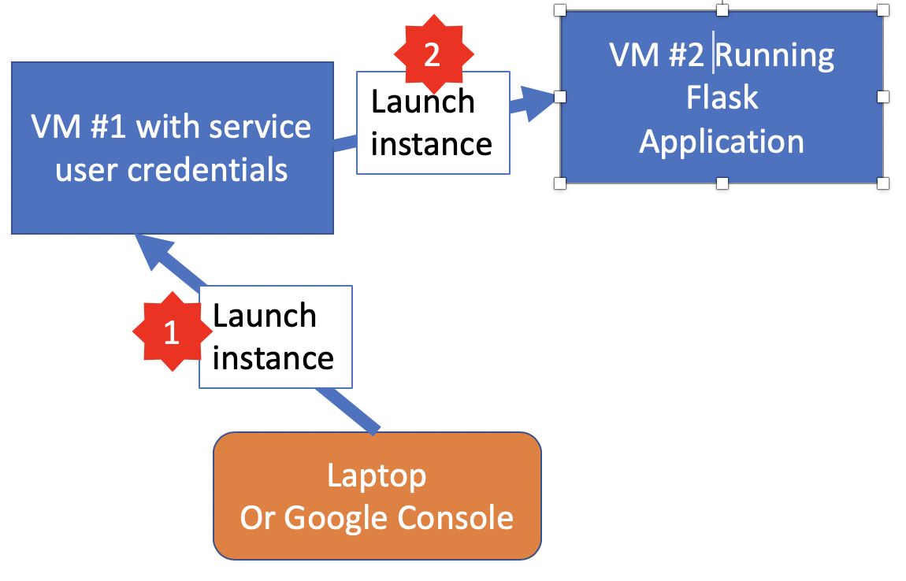
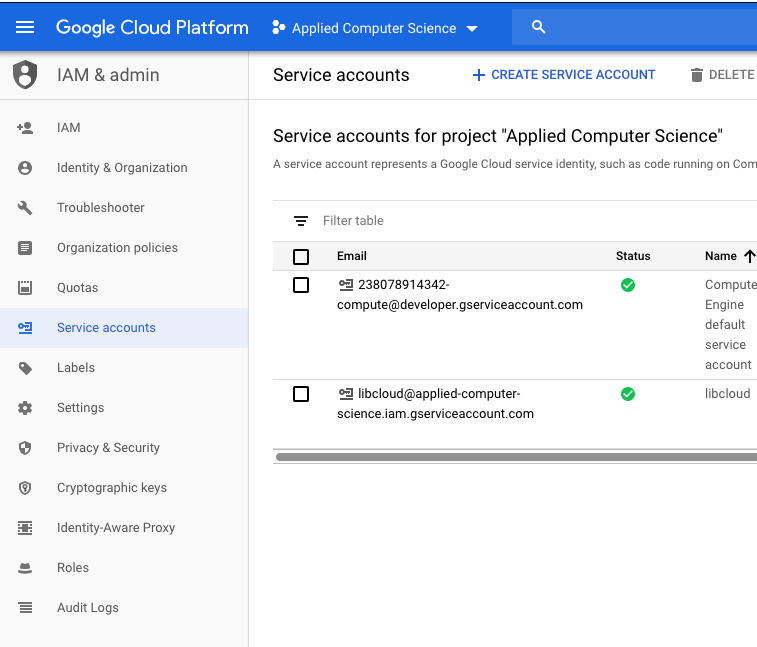
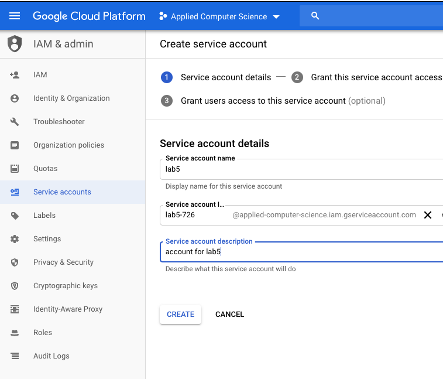
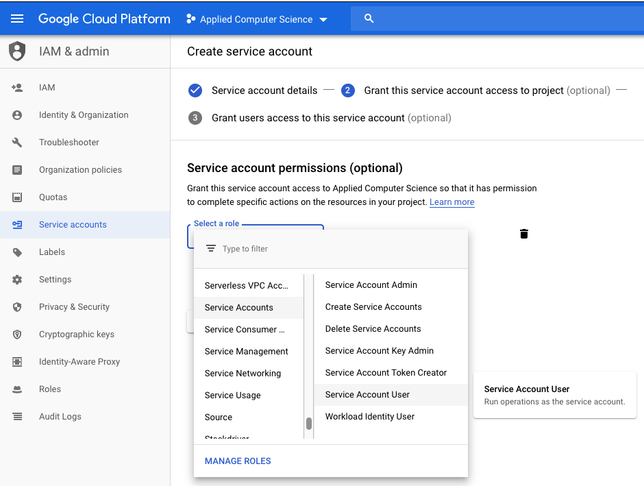
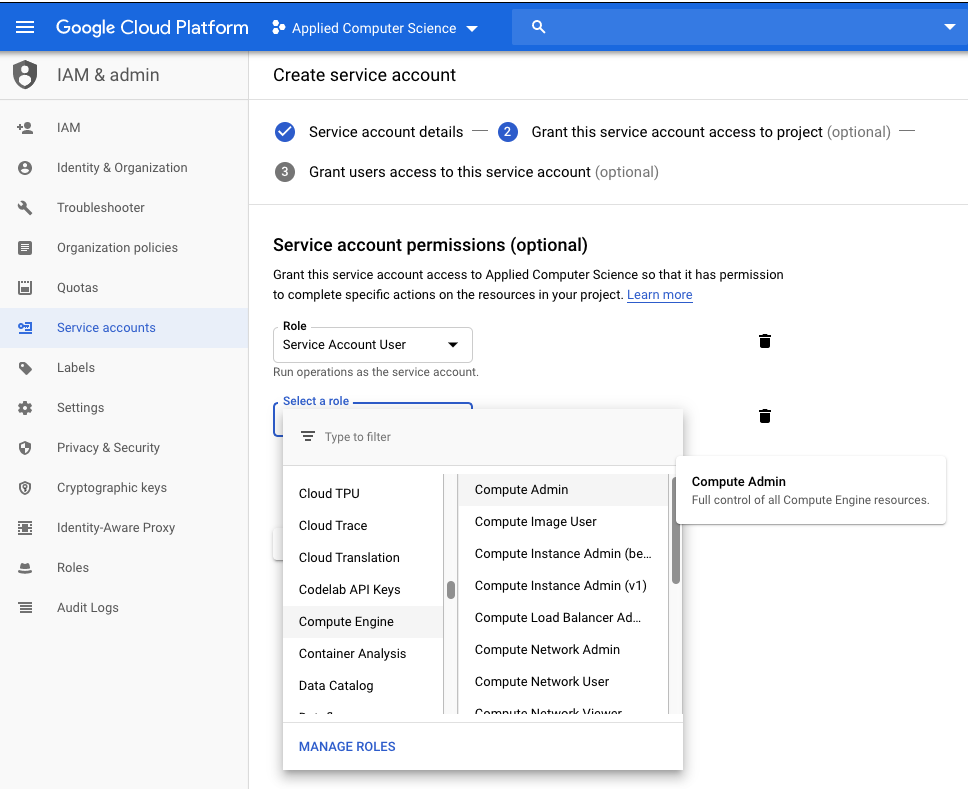
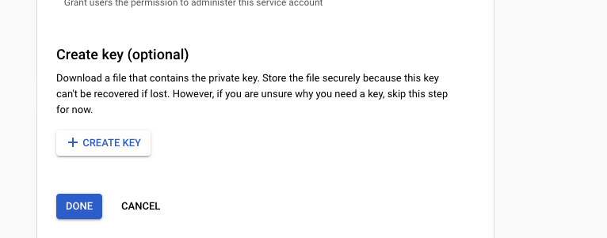

# Part3 - Creating 

In this task, you're going to create a program that runs in a VM
and still create virtual machines, just as in your first example.
The challenge is that the first VM needs to authenticate itself
to Google Cloud in order to create VM's. Let's look at this diagramtically
using the following figure:

When you're using your laptop or Google Cloud Console to create VM's,
authentication information is automatically retrieved and sent to Google
as part of the API requests that describe what rights and permissions you have.
In this scenario, you will use your laptop to create a VM (step 1) that
will then launch another VM (step 2) that has the Flask application.
The launching VM created in step 1 needs to directly authenticate to Google
when it tries to launch the Flask application. To do this, you will be using 
a [service account](https://google-auth.readthedocs.io/en/latest/reference/google.oauth2.service_account.html#module-google.oauth2.service_account).
A service account is like a "password" that can be used to access your google cloud API without you having
to directly authenticate. Knowing how to use service accounts is important if you're
trying to create services that manage your cloud environment when you're not around.

To use a service account you need to:
* Create the service account
* Give it specific permissions (e.g. ability to create a VM)
* Get the key credentials so your program can use them

We'll show you the steps needed to create a service account below
there is a program interface for this do this but we'll cheat and use  the
Google console.

Once you have your credentials file (this will be a JSON file), we need to provide
it to Google for authentication. The write up for the `google.auth` library explains service accounts,
and there's also a writeup [the google cloud documentation](https://cloud.google.com/iam/docs/understanding-service-accounts).

The code stub in `part3.py` uses the `google.oauth` library to authenticate using
credentials stored in a file called `service-credentials.json`. You can use those
credentials to launch the first VM. You should use `part3.py` to create a VM and provide the service credentials to that VM (step 1). That first VM **must** have a copy of the service-credential file 
on the VM when it is running because it will need those credentials to launch the second VM.

The `startup_script` for that first VM will create the *second* VM that will run the `flask`
application as before. That startup script will run a Python program that then starts the
second VM, but that python program needs to have the credentials to be successful.

** N.B. security ** - The second VM does not need access to the service credentials, and in general you want to be careful in sharing or exposing those credentials. If someone else had them, they could create VM's, networks and so on just as you could. The benefit of service accounts is you can then restrict their abilities,
limiting them to the specific API routines needed.

## Creating your service account
Follow the steps below to create a service account and then save the resulting JSON credentials into a file
called `service-credentials.json`

### Go to the Google Console IAM service

### Then create an account

### Then set it as a serviceAccountUser

### Then compute admin

### Then create the key and save the JSON file

